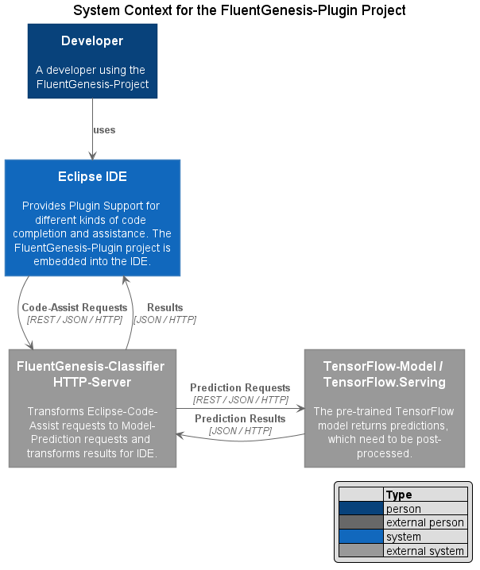

# FluentGenesis-Plugin

This is a project to implement a very basic interface to interact between Eclipse and my other projects. 
The main goal is to invoke the content assist / code completion from eclipse, as well as extract data 
interactively for different kind of predictions and analysis.

This is just part of a proof-of-concept, and it will leak out the content of the file which is currently edited, 
to another endpoint. (e.g. a python based http server, or something similar, not sure about the sink)

This plugin is not intended for production. That said I'm not an expert  on eclipse-plugins, therefore 
please do not copy bad habits I simply might not know about.

Maybe i will integrate it into a client-server-server architecture presenting a feed of the latest predictions
made by a transformer-based model.

# System Context

To further understand the architecture, you might want to have a look at the following diagram.

# Resources / Links

* Very small/minimal content-assist-example
  * https://github.com/monperrus/content-assist-example
  * https://github.com/monperrus/content-assist-example/blob/master/src/content_assist_example/ExampleProposalComputer.java
  
* Also compact example also showing how to add the icon / contains some interesting helper methods...
  * http://codeandme.blogspot.com/2014/05/extending-jsdt-adding-your-own-content.html
  
* The more elaborate HippieProposal-Stuff
  * https://stackoverflow.com/questions/51223063/
  * https://github.com/eclipse/eclipse.platform.text/blob/master/org.eclipse.ui.workbench.texteditor/src/org/eclipse/ui/texteditor/HippieProposalProcessor.java
  * https://github.com/eclipse/eclipse.jdt.ui/blob/master/org.eclipse.jdt.ui/ui/org/eclipse/jdt/internal/ui/text/java/HippieProposalComputer.java
  * https://stackoverflow.com/questions/20779899

* What is the categoryId?
  * https://www.eclipse.org/forums/index.php/t/78237/

* Eclipse Extension points reference / This is for Javascript, but the extensionpoints are merely equally described
  * https://help.eclipse.org/2020-06/topic/org.eclipse.jdt.doc.isv/reference/extension-points/index.html?cp=3_1_1
    * https://help.eclipse.org/2020-06/topic/org.eclipse.jdt.doc.isv/reference/extension-points/org_eclipse_jdt_ui_javaCompletionProposalComputer.html
    * https://help.eclipse.org/2020-06/topic/org.eclipse.jdt.doc.isv/reference/extension-points/org_eclipse_jdt_ui_javaCompletionProposalSorters.html
    * https://help.eclipse.org/2020-06/topic/org.eclipse.jdt.doc.isv/reference/extension-points/org_eclipse_jdt_ui_javaEditorTextHovers.html
    * https://help.eclipse.org/2020-06/topic/org.eclipse.jdt.doc.isv/reference/extension-points/org_eclipse_jdt_ui_queryParticipants.html
    * https://help.eclipse.org/2020-06/topic/org.eclipse.jdt.doc.isv/reference/extension-points/org_eclipse_jdt_ui_quickAssistProcessors.html
    * https://help.eclipse.org/2020-06/topic/org.eclipse.jdt.doc.isv/reference/extension-points/org_eclipse_jdt_ui_quickFixProcessors.html

* Eclipse Help/API - Refactoring
  * https://help.eclipse.org/2019-12/index.jsp?topic=%2Forg.eclipse.jdt.doc.isv%2Freference%2Fapi%2Forg%2Feclipse%2Fjdt%2Fcore%2Frefactoring%2Fparticipants%2Fpackage-summary.html
  * https://help.eclipse.org/2020-06/index.jsp?nav=%2F4
  * https://help.eclipse.org/2020-06/index.jsp?topic=%2Forg.eclipse.jdt.doc.isv%2Freference%2Fapi%2Forg%2Feclipse%2Fjdt%2Fui%2Ftext%2FIJavaPartitions.html

* How-To Rename a method using JDT
  * https://stackoverflow.com/questions/12968328/how-to-programmatically-rename-a-method-using-jdt

* Eclipse-LSP
  * https://www.eclipse.org/community/eclipse_newsletter/2017/may/article3.php

* An eclipse plugin for automatic refactoring / will be integrated in future versions of eclipse
  * https://github.com/JnRouvignac/AutoRefactor
  
* Writing an Eclipse plugin
  * https://cvalcarcel.wordpress.com/2009/10/11/writing-an-eclipse-plug-in-part-5-adding-icons-and-a-new-project-structure/

* Sending a request via Java HTTPConnection / and read result
  * https://www.baeldung.com/java-http-request